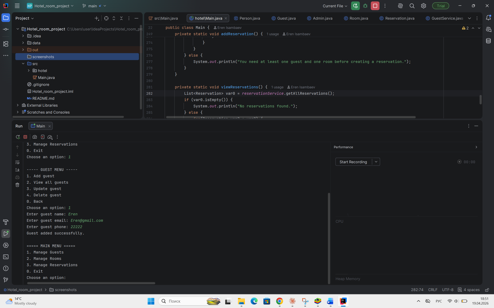
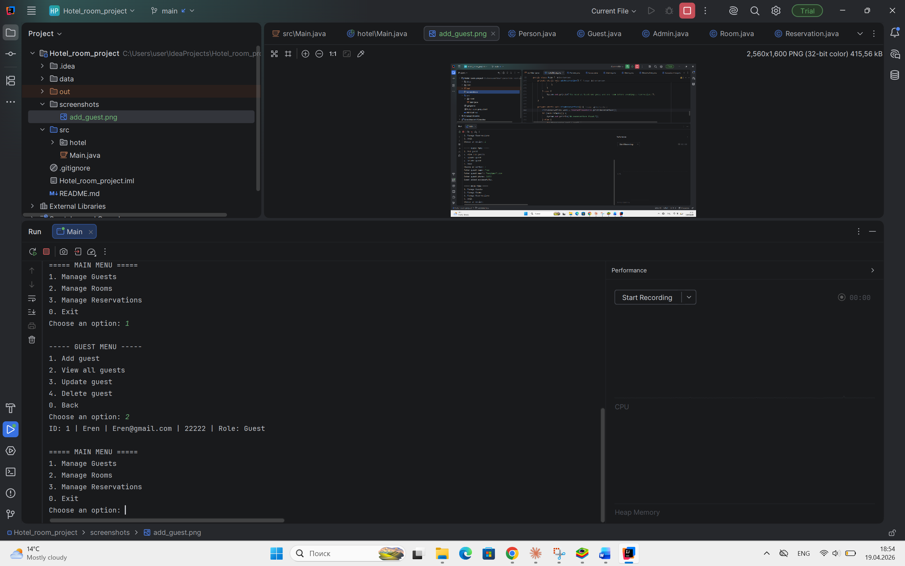
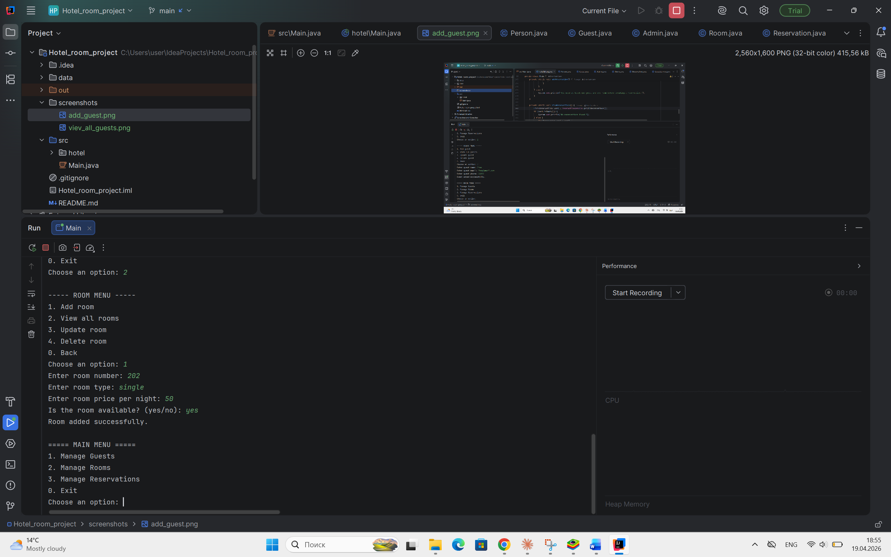
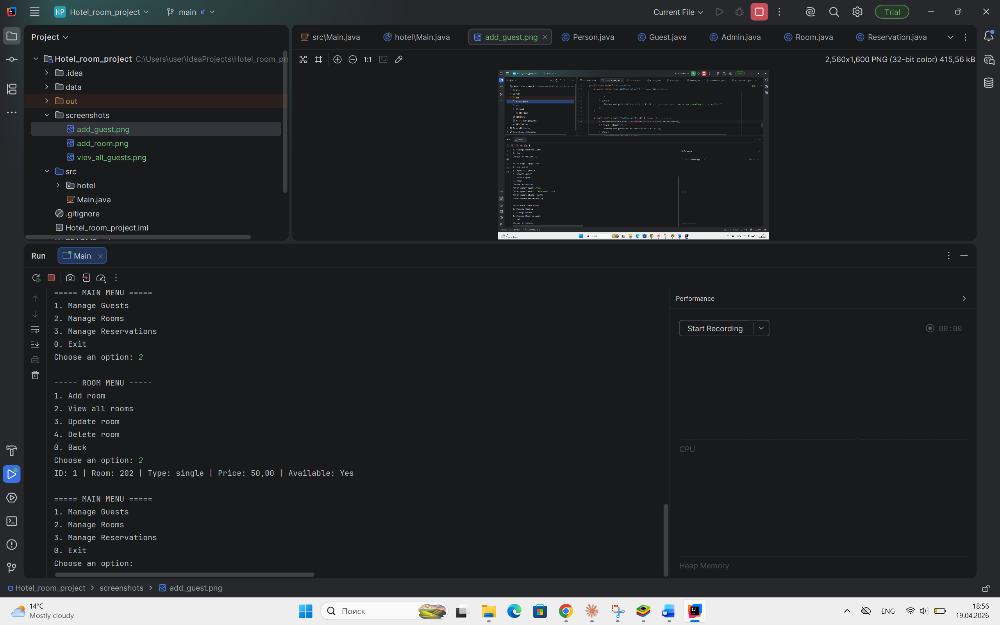
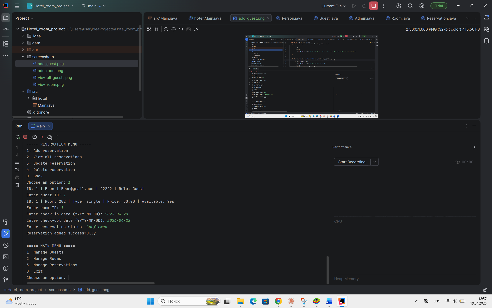
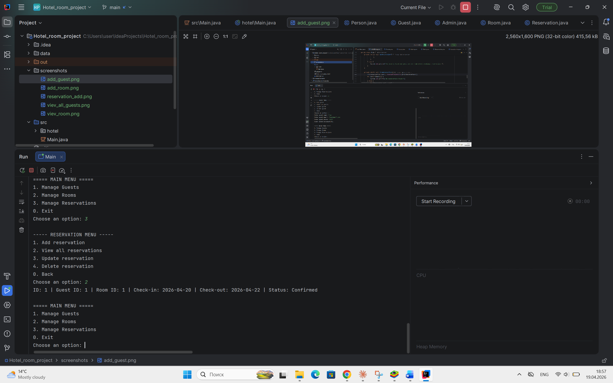
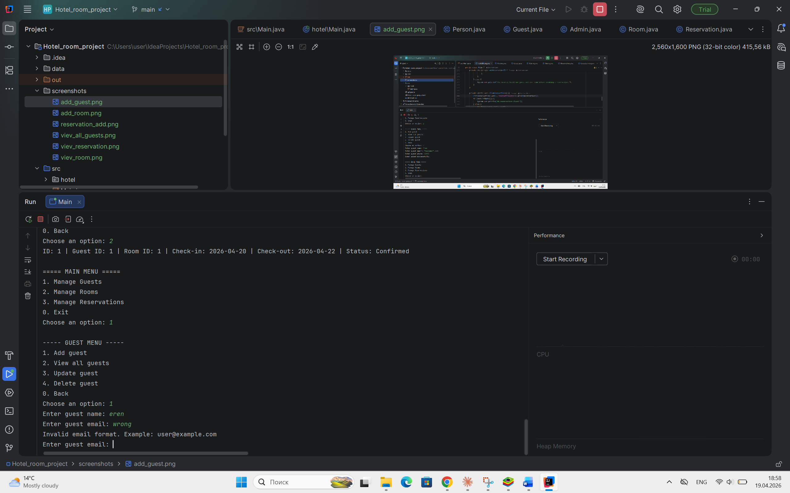
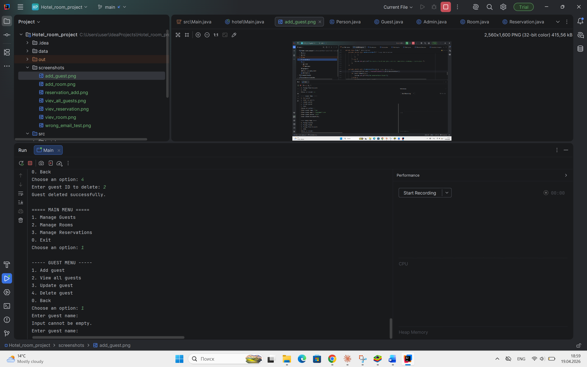
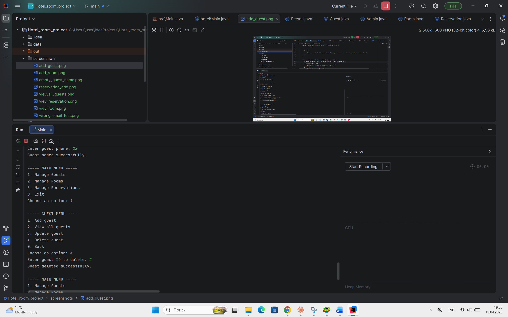

# Hotel Room Reservation System

## Student

Eren Isambaev

## Description

This project is a console-based Hotel Room Reservation System developed in Java. The application allows users to manage hotel operations such as guests, rooms, and reservations through a simple command-line interface.

The system supports basic CRUD (Create, Read, Update, Delete) operations, allowing users to add, view, update, and delete records. It also includes input validation, file-based data storage, and object-oriented programming principles such as encapsulation, inheritance, and polymorphism.

The program runs in the console of IntelliJ IDEA, where users interact with the system by entering menu options and data manually.

## Objectives

The main objectives of this project are:

* To develop a console-based application using Java.
* To implement CRUD operations for managing guests, rooms, and reservations.
* To apply Object-Oriented Programming (OOP) principles such as encapsulation, inheritance, and polymorphism.
* To implement input validation to ensure correct data entry.
* To use file handling for data persistence between program executions.
* To design a modular and structured application for better code organization.
* To handle errors and unexpected situations gracefully.

## Project Requirement List

The following requirements were implemented in this project:

1. Implement CRUD operations for Guests.
2. Implement CRUD operations for Rooms.
3. Implement CRUD operations for Reservations.
4. Develop a Command Line Interface (CLI) for user interaction.
5. Validate user inputs (email format, empty fields, dates).
6. Store data using file handling for persistence.
7. Use modular design by dividing the code into classes and methods.
8. Implement error handling using try-catch blocks.
9. Apply encapsulation using private fields with getters and setters.
10. Implement inheritance (Person → Guest/Admin).
11. Demonstrate polymorphism using overridden methods.

## Documentation

### Algorithms

The program uses menu-driven logic with loops and conditional statements to allow users to navigate through different options such as managing guests, rooms, and reservations.

CRUD operations are implemented using service classes, where each operation (create, read, update, delete) is handled through specific methods.

### Data Structures

* Lists are used to store collections of guests, rooms, and reservations.
* Objects represent real-world entities such as Guest, Room, and Reservation.

### Modules / Classes

* **Main** – controls the program flow and user interaction.
* **Model classes** (Guest, Room, Reservation, Person) – represent data entities.
* **Service classes** – handle business logic and file operations.
* **Utility classes** – handle input validation and file reading/writing.

### Challenges Faced

* Setting up project structure and packages.
* Handling file reading and writing correctly.
* Managing user input validation.
* Fixing issues related to Git and project setup.

## Data Export and Import

The project supports data export and import in CSV format.

Users can:
- export guests to CSV
- export rooms to CSV
- export reservations to CSV
- import guests from CSV
- import rooms from CSV
- import reservations from CSV

This functionality is available through the console menu.

## Authentication and User Roles

The project includes a basic authentication system.
Users must log in before using the system.

User data is stored in a file:
- `data/users.txt`

Two roles are supported:
- `ADMIN` – full access to all operations
- `USER` – view-only access

Default accounts:
- admin / admin123
- user / user123

# Hotel_room_reservation_system

## Screenshots

### Main Menu

### Add Guest

### View Guests

### Add Room

### View Rooms

### Add Reservation

### View Reservations

### Invalid Email

### Invalid name

### Delete Guest

https://docs.google.com/presentation/d/1kBQ7ldU7TdJyPxKqaeuw0RIFDM7MzxIM/edit?usp=drivesdk&ouid=114669002090300183307&rtpof=true&sd=true